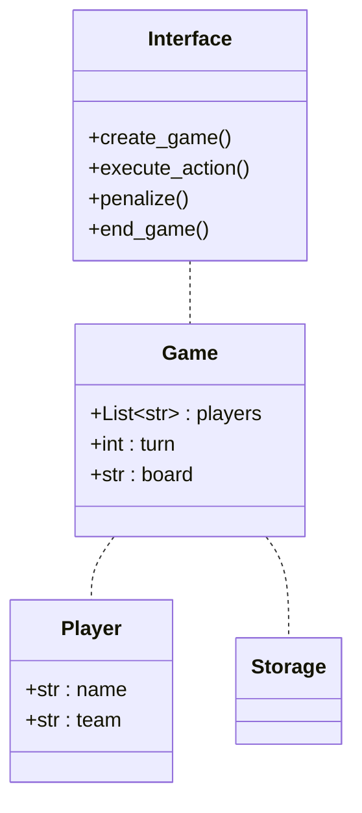

# Tic-tac-toe

The famous tic-tac-toe game written in Kotlin language.

## Class diagram

## Project

This is the Miyagi Project.

A project created for the Mentorship program at Eventbrite.

## Authors✒️

⌨️[@ibrizuela-eb](https://github.com/ibrizuela-eb)